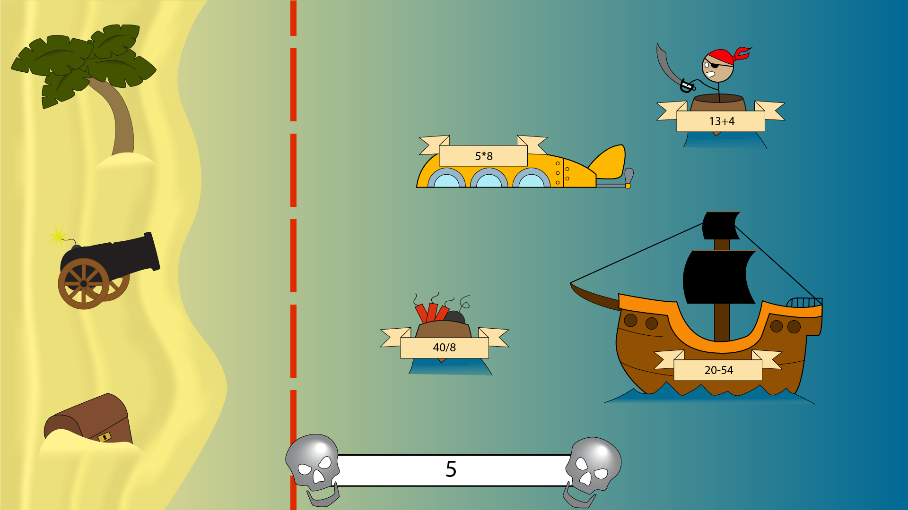

## 2021l4web-app-mockup-vlcekk
2021l4web-app-mockup-vlcekk created by GitHub Classroom
# Kvízová hra, kde hráč bojuje proti hordě nepřátel vypočítáváním příkladů

Jednoduchá hra s pirátskou tématiku, ve které připlouvají nepřátelé z levé strany. Každý nepřítel má na sobě příklad a úspěšné napásání výsledku nepřítele zničí (nebo ubere část životů).
Hráč obdrží poškození, dostane-li se nepřítel na červenou čáru.

Předvytovořené jsou svg soubory pozadí, kanónu, nepřátel a HUD. Vše se dá dodatečně dle libosti do animovat.

Animace kanonu při střelbě

